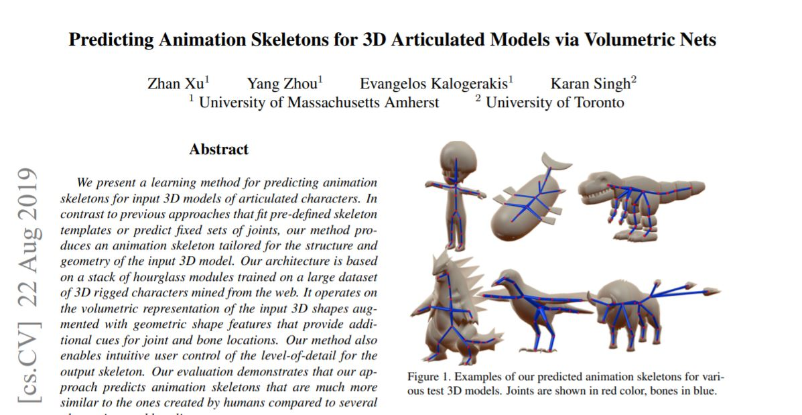
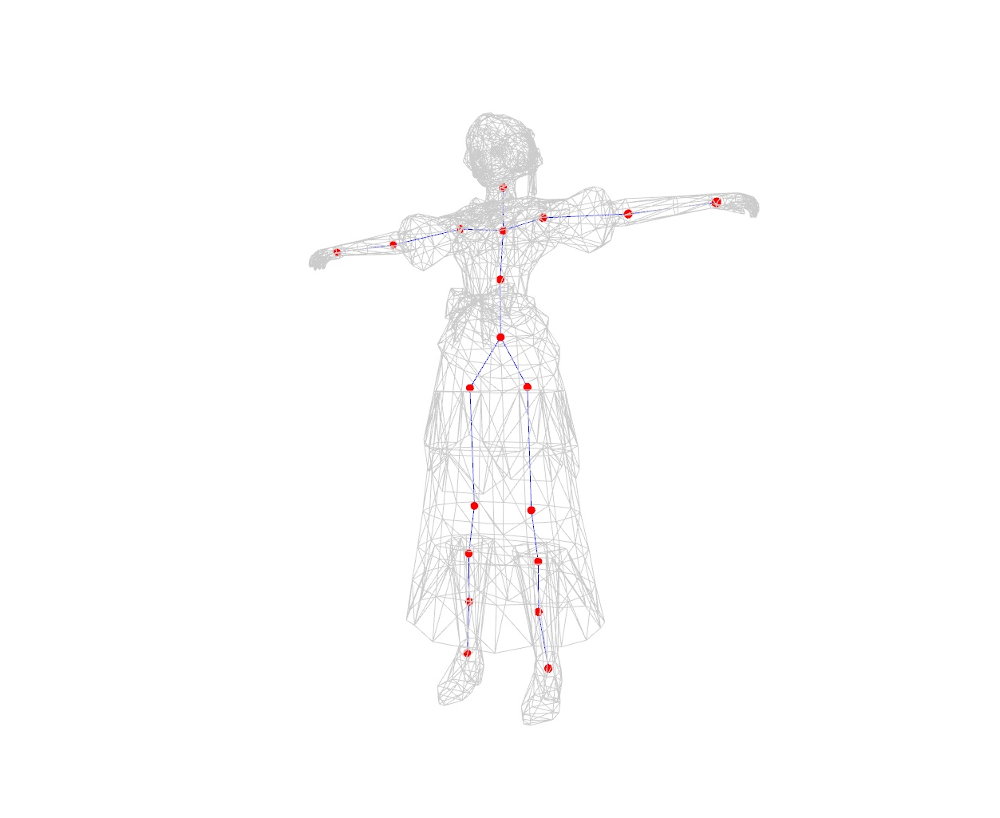
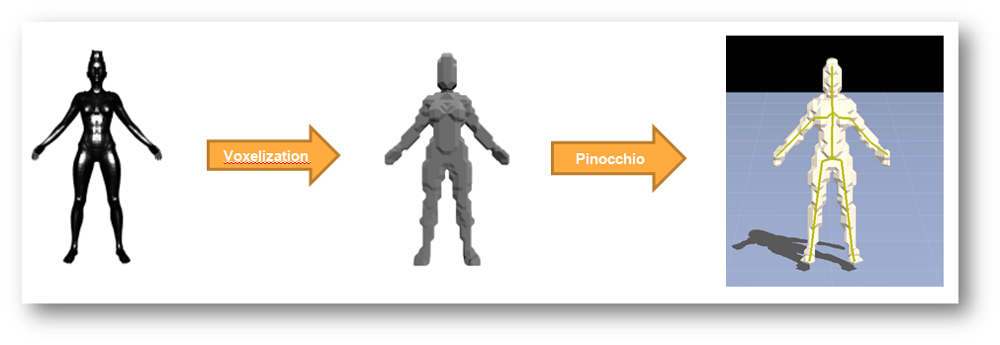

# Computer-Graphical-Auto_Rig
Auto_Rigging in Computer Graphical

## 1.AnimatedVolSkeleton :  

### A.Front-end work : 
Create Inviroment : 
    - Install UBUNTU(Linux)
    - CUDA(GPU)
    - Divide Hard-drive/ 

### B.Main Work : 
    1.Implement Paper  :  AnimatedVolSkeleton/ Others Related-Work Paper  
        - http://github.com - automatic!
[Paper's Link Siggraph 2019Aug](https://arxiv.org/pdf/1908.08506.pdf)
        

    2.Main Code : 3 Main Python Code in running this project  

    3.Result : Reappear the Paper's Auto-Rigging  

## 2.Pinocchio :

-  Complete the preprocess work "Voxelization" for Pinocchio runinng  

### The Processing flow : 

-  From a.(.OBJ/.FBX File) -> b.Vexlization -> c.Pinocchio

